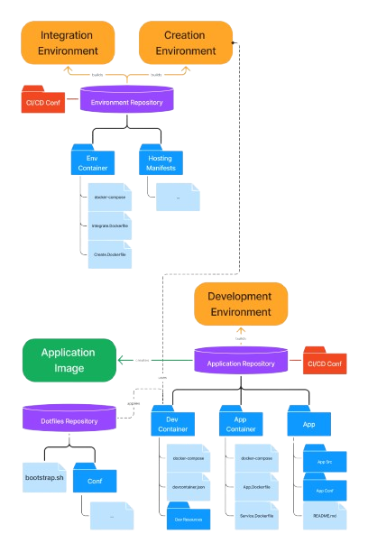

# Toolchain as Code

> Ostfalia University of Applied Sciences  
> Computer Science, Software Engineering  
> 2024  
> 
> Jan Rother  
> janrother02@gmail.com  

## Table of Contents

<!-- TOC -->
* [Toolchain as Code](#toolchain-as-code)
  * [Table of Contents](#table-of-contents)
  * [Introduction](#introduction)
    * [Overview](#overview)
    * [Scientific Work](#scientific-work)
    * [Demarcation](#demarcation)
  * [Repositories](#repositories)
  * [Accessing the Project](#accessing-the-project)
  * [License](#license)
  * [Miscellaneous](#miscellaneous)
<!-- TOC -->

-----

## Introduction

### Overview

The **Toolchain as Code** project is a proof of concept and template project emerged from a bachelor thesis at the *Ostfalia University of Applied Sciences*. The project aims to provide a comprehensive guide and template for benefiting from a toolchain as code strategy in software development projects.

### Scientific Work

The related scientific work by [Jan Rother](https://github.com/JanRother/) has the following title:

> **From the IDE to the Service:**  
> Toolchain as Code Strategy to Overcome the Development-Deployment-Gap in Application Management at a Major Automotive Manufacturer

*Modern software engineering relies on a wide range of technical tools and organizational methods that support developers in building high-quality software, yet this variety also introduces challenges, particularly with growing complexity in development and deployment environments. Each area, development and deployment, comes with its own set of sometimes very specific requirements, and as projects adopt more technologies and tools, a "development-deployment-gap" can emerge, making processes more time-consuming and prone to errors.*

*Based on a project in the application management division of a major automotive manufacturer, this study examines current strategies to address this gap and identifies developer's key requirements for an effective solution. Using a combination of literature review and expert interviews, this work develops a "toolchain-as-code" strategy, that moves and centralizes configuration of tools in software repositories, leading to an improvement of overall toolchain consistency. This thesis aims to establish best practices for development with software containers in the context of web development and microservice architectures, while taking security, maintainability, and performance into account. A prototype based on the findings of this study will demonstrate the strategy’s feasibility and value, providing a practical guide for implementation.*

For more details see [JanRother/bachelor-thesis](https://github.com/JanRother/bachelor-thesis).

### Demarcation

This project is not meant to be a direct implementation of the scientific work. Instead, it serves as a template and guide for setting up a toolchain as code for software development projects. As a proof of concept, it demonstrates the feasibility and value of the approach and provides a starting point for implementing a toolchain as code in real-world projects.

## Repositories

The *Toolchain as Code* project consists of multiple repositories, each dedicated to a specific type of content. Here is an overview of the repositories:

|    | Repository                 | Location          | Description of Content                     |
|----|----------------------------|-------------------|--------------------------------------------|
| 00 | **Application Repository** | `tac-application` | Application source code and configuration. |
| 01 | **Environment Repository** | `tac-environment` | Environment configuration.                 |
| 02 | **Dotfiles Repository**    | `tac-dotfiles`    | Environment customizations.                |

- `Toolchain-as-Code`/[`tac-application`](https://github.com/Toolchain-as-Code/tac-application)
- `Toolchain-as-Code`/[`tac-environment`](https://github.com/Toolchain-as-Code/tac-environment)
- `Toolchain-as-Code`/[`tac-dotfiles`](https://github.com/Toolchain-as-Code/tac-dotfiles)

The project follows precisely the architecture described by the *Toolchain as Code* approach.

## Accessing the Project

The repositories are available via *GitHub* under [github.com/Toolchain-as-Code/\<repository\>](https://github.com/Toolchain-as-Code/), where `<repository>` is the name of the repository.

Any of the repositories are publicly accessible and configured to serve as template repositories. This means, a new repository based on the contents of the template repository can be created with ease.

## License

The content of this project is licensed under the terms of the **MIT License**. It is free software that can be used, modified, and distributed under the terms of the license. For details, see the `LICENSE` files contained in the respective repositories.

## Miscellaneous

This document was created by [Jan Rother](https://github.com/JanRother/).  
For feedback on this project, please contact me.  

**Have fun!**
